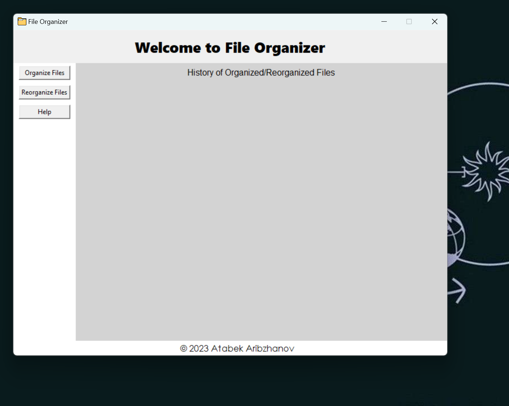
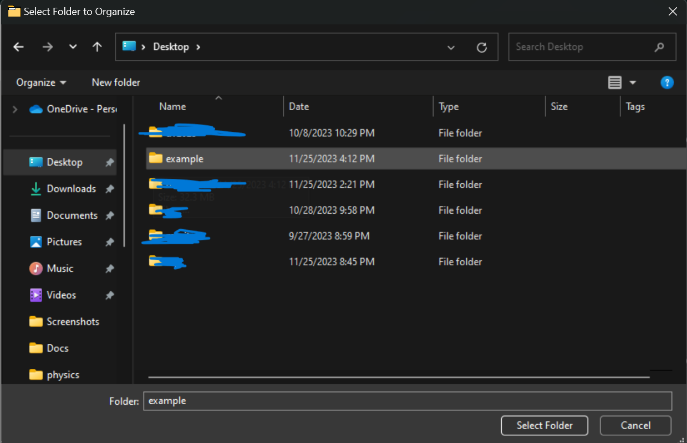
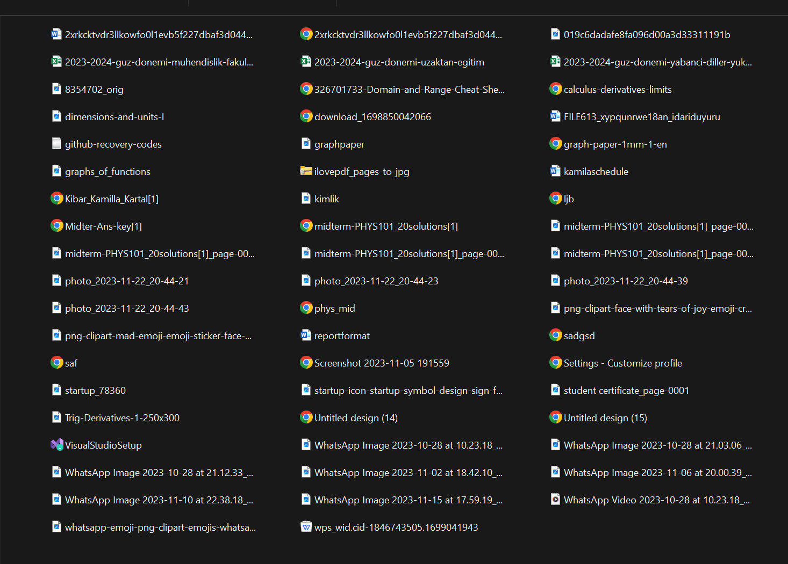
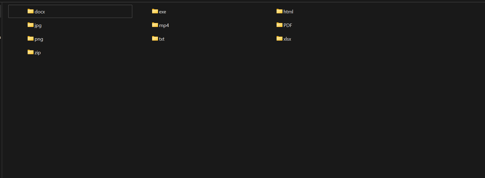
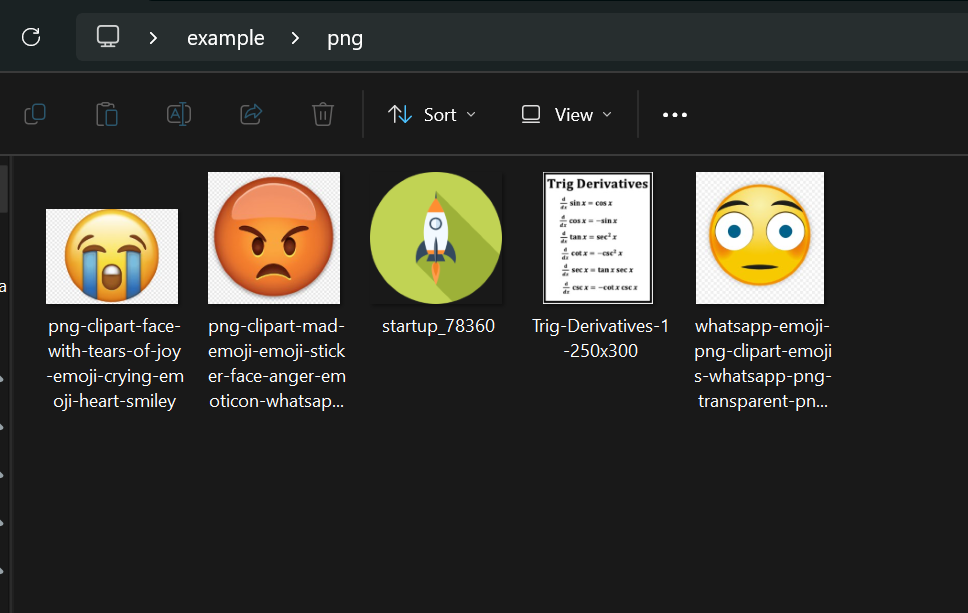

# File Organizer v0.1

<div style="display: flex; flex-wrap: wrap;">
    
    
    
    
    
</div>


## Description

File Organizer v0.1 is a simple Python-based GUI application built using the Tkinter library. It allows users to organize and reorganize files within a selected directory by grouping them based on their file extensions. Future updates and improvements are currently in development for upcoming versions of File Organizer. Stay tuned for additional features and enhancements in the next releases.

## Features

- **Organize Files:** Sorts files in a selected directory based on their file types.
- **Reorganize Files:** Reverts the organization of files to their original directory.
- **History Log:** Keeps a history log of organized and reorganized files.

## Usage
1. **Organize Files:**
   - Click 'Organize Files'.
   - Select the folder you want to organize.

2. **Reorganize Files:**
   - Click 'Reorganize Files'.
   - Select the folder to revert the organization.

## Installation

1. Clone the repository:
   ```bash
   git clone https://github.com/Atabek786/file-organizer.git
   ```
2. Run the application
   ```bash
   python main.py
   ```
## License

This project is licensed under the LGPL-2.1 license.

